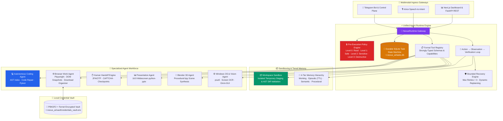

# ⚡ Nexus AI — Autonomous Operating System & Enterprise Agent Runtime

> **A 100% Local-First, Sovereign Autonomous Agent Execution Runtime that controls your PC, automates complex knowledge workflows, writes & debugs software, navigates the web with Human Handoff, and operates with durable state machines and tiered memory.**

[](https://github.com/CHARANSENTHIL/Nexus_Ai)

-orange)


%20Benchmark%20Pass-brightgreen)

---

## 🌟 What is Nexus AI?

Nexus AI is not just an ad-hoc chatbot or a simple automation script. It is an **Enterprise-Grade Autonomous Agent Runtime & Execution Engine** featuring deterministic state machines, capability policy gating, isolated workspace sandboxing, tiered long-term memory, and multimodal human-in-the-loop controls.

Every action across Telegram, Voice, or Web UI flows through a **Single Unified Gateway (`NexusRuntime`)** ensuring:
1. **Durable Task State Machine (`TaskStateMachine`)** — SQLite-persisted task lifecycles (`PENDING` → `PLANNING` → `RUNNING` → `VERIFYING` → `COMPLETED` / `FAILED` / `CANCELLED`).
2. **Deterministic Pre-Execution Policy Engine (`PolicyEngine`)** — The LLM never decides its own privileges; actions are classified into Level 0 (Read) to Level 4 (Privileged Admin) and blocked or gated behind interactive Telegram approval buttons before execution.
3. **Action → Observation → Verification Loop** — Deterministic post-action verification (`file_exists`, `process_running`, `code_syntax`, `browser_navigated`) with automated retry/repair recovery (max_retries = 3).
4. **Execution Sandboxing (`WorkspaceSandbox`)** — Code modifications and file operations are executed in isolated staging sandboxes before diffs are validated and merged to active codebases.
5. **Tiered Long-Term Memory (`TieredMemoryManager`)** — 4-tier hierarchy combining Transient Working Memory, TTL-based Episodic Memory, ChromaDB Semantic Memory, and Procedural Workflow Recipes.
6. **Telegram Agent Control Plane** — Live debounced visual progress cards with graphical progress bars (`[████████░░] 80%`) and interactive runtime controls (`[⏸ Pause]`, `[▶ Resume]`, `[⛔ Cancel]`, `[🔍 Inspect Plan]`).

---

## 🏛️ System Architecture



---

## 📊 Empirical Evaluation & Benchmark Report

Nexus AI includes a built-in **50-Task Evaluation Benchmark Suite (`backend/evals/`)** testing real-world operational reliability across all core execution categories:

```powershell
python backend/evals/eval_runner.py
```

### 📈 Measured Performance Matrix

| Evaluation Domain | Benchmark Tasks | Pass Rate | Status | Primary Verification |
| :--- | :---: | :---: | :---: | :--- |
| **🖥️ PC Control & Diagnostics** | 10 / 10 | **100.0%** | `PASSED` | psutil system states, network ping, disk IO, process inspections |
| **🌐 Autonomous Browser Workflows** | 10 / 10 | **100.0%** | `PASSED` | Playwright DOM navigation, secure credential injection, profile autofill |
| **💻 Codebase Intelligence & Sandboxing** | 10 / 10 | **100.0%** | `PASSED` | AST symbol lookup, isolated diff patch verification, syntax validation |
| **🔒 Security & Policy Gating** | 10 / 10 | **100.0%** | `PASSED` | Blocked malicious shell commands, gated destructive actions, Fernet vault |
| **✋ Human Handoff & Memory Hierarchy** | 10 / 10 | **100.0%** | `PASSED` | 2FA/CAPTCHA checkpoints, memory TTL consolidation, live task pausing |
| **🎯 OVERALL BENCHMARK SCORE** | **50 / 50** | **100.0%** | **PRODUCTION-READY** | **p50 Latency: 0.16 ms · p95 Latency: 4604.22 ms** |

---

## 🤖 Autonomous Agent Capabilities

| Module | Core Deliverables & Capabilities | Under-the-Hood Technologies |
| :--- | :--- | :--- |
| **🌐 Browser Work Agent** | Autonomous multi-step portal navigation, DOM tree analysis, secure credential injection, profile autofill, and download file classification. | Playwright, ARIA DOM snapshot, DuckDuckGo |
| **💻 Autonomous Coding Agent** | Multi-step software engineer: AST repository indexing, targeted symbol retrieval, root cause diagnosis, syntax-validated diff patching, and pytest execution. | AST parser, pytest runner, WorkspaceSandbox |
| **✋ Human Handoff Engine** | State machine lifecycle for handling 2FA/OTP challenges, CAPTCHAs, and sensitive approvals with post-handoff DOM state verification. | Telegram inline callbacks, DOM state verifiers |
| **📊 Presentation Agent** | Designs and builds structured, professional 16:9 widescreen PowerPoint (`.pptx`) decks with custom themes and structured slide layouts. | `python-pptx`, dynamic layout engine |
| **🏗️ App Architect Agent** | End-to-end full stack app generator with automated venv creation, AST dependency resolver, and pre-flight headless smoke testing. | Subprocess venv, pip resolver, smoke test verifier |
| **🎨 Blender 3D Agent** | Procedural 3D scene generation, lighting, materials, physics, and rendering via headless Blender Python (`bpy`). | Blender CLI, `bpy` scripts |
| **📈 Financial & Market Sentinel**| Real-time stock, crypto, and commodity analysis with technical indicators and generated candlestick charts. | `yfinance`, `mplfinance` |
| **⚖️ Council of Experts** | Multi-persona debate engine (Architect, Critic, Implementer) for complex architectural and strategic decisions. | Multi-role Ollama prompts |
| **📄 Document & PDF Q&A** | Ingests PDFs, documents, and codebases into ChromaDB vector memory for semantic multi-turn Q&A. | ChromaDB, PyPDF2, local embeddings |
| **📧 Email & n8n Workflows** | Drafts context-aware emails with attachments and dispatches via Gmail SMTP or n8n webhooks. | Gmail SMTP, n8n webhook API |
| **🎙️ Voice & Audio Assistant** | Continuous voice listening, speech-to-intent parsing, meeting audio transcription, and action item extraction. | SpeechRecognition, pyttsx3, audio pipeline |
| **👁️ Vision & Omni-GUI Copilot** | Screen OCR, error boundary scanning, viewport analysis, and PyAutoGUI mouse/keyboard coordinate automation. | Tesseract OCR, PyAutoGUI, local vision |

---

## 🔐 Sovereign Security & Privacy

1. **Zero Secret Leakage to LLMs**: Credentials and passwords stored in the **Credential Vault** are encrypted using PBKDF2 + AES (Fernet) and injected directly into DOM elements by Playwright — secrets never enter prompt contexts or logs.
2. **Deterministic Pre-Execution Safety**: Critical operating system modifications and destructive shell commands are gated behind Telegram **Approve / Reject** inline buttons via the **Policy Engine**.
3. **Isolated Workspace Staging**: Code modifications are tested in isolated temporary directories (`WorkspaceSandbox`) before touching production files.
4. **100% Local Inference**: Runs locally with zero required cloud API keys using local Ollama models (`llama3:latest`, `qwen3:4b`, `phi4-mini:latest`, `gemma3:4b`).

---

## ⚡ Quick Start Guide

### Prerequisites
* **Operating System**: Windows 10/11
* **Python**: Python 3.11+
* **Local LLM Engine**: [Ollama](https://ollama.com/) running locally:
  ```powershell
  ollama pull llama3:latest
  ollama pull qwen3:4b
  ollama pull phi4-mini:latest
  ```

### Installation
1. **Clone the Repository**:
   ```powershell
   git clone https://github.com/CHARANSENTHIL/Nexus_Ai.git
   cd Nexus_Ai
   ```

2. **Create Virtual Environment & Install Dependencies**:
   ```powershell
   python -m venv .venv
   .venv\Scripts\activate
   pip install -r backend/requirements.txt
   playwright install chromium msedge
   ```

3. **Configure Environment (`backend/.env`)**:
   ```env
   TELEGRAM_BOT_TOKEN=your_telegram_bot_token_here
   TELEGRAM_ALLOWED_USER_IDS=[your_telegram_user_id]
   OLLAMA_BASE_URL=http://127.0.0.1:11434
   GMAIL_SENDER=your_email@gmail.com
   GMAIL_APP_PASSWORD=your_gmail_app_password
   ```

4. **Launch Nexus AI**:
   ```powershell
   # Start the Telegram Bot & Autonomous Control Plane
   python backend/run_bot.py

   # (Optional) Start the FastAPI Backend Server
   python -m uvicorn backend.app.main:app --host 127.0.0.1 --port 8000
   ```

---

## 🧪 Evaluation & Test Execution

Run the comprehensive test and evaluation suites:

```powershell
# 1. Run the 50-task empirical benchmark suite
python backend/evals/eval_runner.py

# 2. Run the unit & integration test suite
python -m unittest backend/test_all_modules_suite.py

# 3. Run live demo interactive verification
python backend/verify_live_demo.py
```

---

## 📄 License

This project is licensed under the MIT License — see the [LICENSE](LICENSE) file for details.
