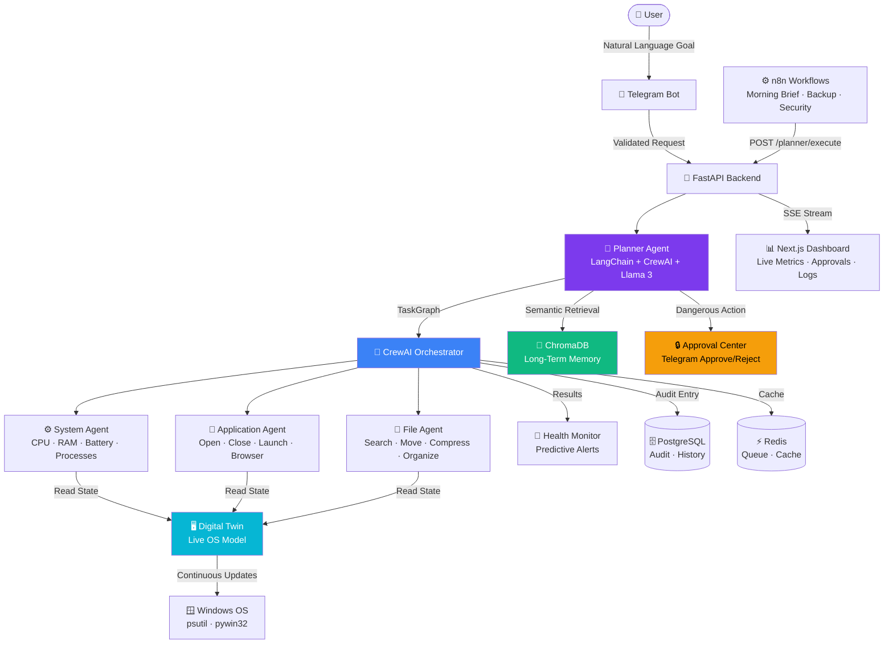

# ⚡ Nexus AI — Autonomous Desktop Agent

> **Production-grade, 100% local-first autonomous AI desktop agent for Windows.**  
> Natural language goals → LangChain + CrewAI + Llama 3 → autonomous multi-step execution → Telegram notifications.

[](https://github.com/yourusername/nexus-ai/actions)


---

## 🧠 What Is Nexus AI?

Nexus AI transforms your Windows computer into an intelligent autonomous assistant. Send a natural language goal via Telegram — the AI plans it, executes it, and reports back.

**Example:**
> You: *"Prepare my laptop for today's coding session."*

Nexus AI automatically:
1. Checks battery + system health
2. Opens VS Code
3. Starts Docker Desktop
4. Opens GitHub in Chrome
5. Starts Spotify
6. Closes distracting apps
7. Verifies internet connectivity
8. Reports: *"✅ Coding workspace ready in 12 seconds."*

No slash commands. No manual steps. Just goals.

---

## 🏗️ Architecture



---

## 🤖 AI Agents

| Agent | Responsibility | Tools |
|---|---|---|
| **Planner** | Decompose goals → TaskGraph | LangChain, CrewAI, Llama 3 |
| **System** | OS monitoring, processes, power | psutil, Digital Twin API |
| **Application** | Open/close apps, browser, shell | subprocess, pywin32 |
| **File** | Search, move, compress, organize | pathlib, shutil, zipfile |

---

## ⚙️ n8n Workflows

| Workflow | Trigger | Action |
|---|---|---|
| ☀️ Morning Brief | Daily 8:00 AM | System health + summary via Telegram |
| 💾 Automatic Backup | Daily 11:00 PM | Compress + archive key folders |
| 💻 Coding Workspace | Webhook | Launch full dev environment |
| 📁 Download Organizer | Weekly Sunday | AI-classify + move Downloads files |
| 🔒 Security Monitor | Every 30 min | Scan processes + USB + alert on threats |

---

## 🚀 Quick Start

### Prerequisites

- **Windows 10/11**
- **Docker Desktop** installed and running
- **Ollama** with Llama 3 already pulled:
  ```bash
  ollama pull llama3
  ollama serve   # must be running on port 11434
  ```
- **Telegram bot token** from [@BotFather](https://t.me/BotFather)

### 1. Clone & Configure

```bash
git clone https://github.com/yourusername/nexus-ai.git
cd nexus-ai
cp .env.example .env
```

Edit `.env` and fill in:
```env
TELEGRAM_BOT_TOKEN=your_bot_token_from_botfather
TELEGRAM_CHAT_ID=your_telegram_chat_id
TELEGRAM_ALLOWED_USER_IDS=your_telegram_user_id
SECRET_KEY=generate-with-python-secrets-token-hex-32
```

> **Get your Telegram user ID:** Message [@userinfobot](https://t.me/userinfobot) on Telegram.

### 2. Launch with Docker Compose

```bash
docker compose up --build
```

This starts:
| Service | URL |
|---|---|
| 🚀 FastAPI Backend | http://localhost:8000 |
| 📊 Dashboard | http://localhost:3000 |
| ⚙️ n8n | http://localhost:5678 |
| 🗄️ PostgreSQL | localhost:5432 |
| ⚡ Redis | localhost:6379 |
| 🧠 ChromaDB | localhost:8001 |

### 3. Verify

```bash
curl http://localhost:8000/health
# {"status":"healthy"}
```

Open http://localhost:3000 to see the live dashboard.

Send a message to your Telegram bot:
> *"Check my system health"*

---

## 🛠️ Local Development (Without Docker)

```bash
# Create and activate virtual environment
python -m venv .venv
.venv\Scripts\activate   # Windows PowerShell

# Install backend dependencies
cd backend
pip install -r requirements.txt

# Run backend
uvicorn app.main:app --reload --port 8000

# In a new terminal — run frontend
cd frontend
npm install
npm run dev
```

---

## 📋 API Reference

### `POST /api/v1/planner/execute`
Execute a natural language goal via the AI pipeline.

**Request:**
```json
{
  "goal": "Prepare my laptop for coding",
  "user_id": "user123",
  "context": {}
}
```

**Response:**
```json
{
  "task_id": "uuid",
  "status": "completed",
  "subtasks": [
    {"id": "task_1", "title": "Check system health", "agent": "system", "status": "completed"}
  ],
  "result": {"summary": "All tasks completed successfully"},
  "execution_time_seconds": 8.4
}
```

### `GET /api/v1/metrics/stream`
SSE stream of live system metrics (CPU, RAM, disk, battery, network) — updates every 3 seconds.

### `GET /api/v1/digital-twin/state`
Returns the current Digital Twin system snapshot.

### `GET /api/v1/planner/audit-log?limit=50`
Returns the last N audit log entries.

### `GET /api/v1/planner/pending-approvals`
Lists all dangerous actions awaiting Telegram approval.

### `POST /api/v1/planner/resolve-approval`
Resolve a pending approval from the dashboard UI.

---

## 🔒 Security

- **Telegram whitelist** — only authorized user IDs can interact with the bot
- **JWT authentication** — all internal API calls require a signed token
- **Approval Center** — dangerous actions (file delete, shutdown, process kill) are blocked until explicit approval
- **Audit log** — every action logged with timestamp, user, reasoning, and outcome
- **No hardcoded secrets** — all credentials via `.env` / environment variables

---

## 🧪 Testing

```bash
# Activate venv first
.venv\Scripts\activate

cd backend
pytest tests/ -v

# Run specific test file
pytest tests/test_agent_tools.py -v
```

**Test coverage:**
- `test_digital_twin.py` — Digital Twin service
- `test_health_monitor.py` — Predictive health alerts
- `test_auth.py` — JWT + whitelist
- `test_db_connectors.py` — DB/Redis/Chroma connections
- `test_api.py` — REST endpoints
- `test_agent_tools.py` — 23 agent tool tests

---

## 📁 Project Structure

```
nexus_ai/
├── backend/
│   ├── app/
│   │   ├── main.py               # FastAPI entry point
│   │   ├── config.py             # Env-based settings
│   │   ├── auth/                 # JWT + Telegram whitelist
│   │   ├── db/                   # PostgreSQL, Redis, ChromaDB clients
│   │   ├── digital_twin/         # Live OS Digital Twin service
│   │   ├── health_monitor/       # Predictive health background worker
│   │   ├── memory/               # ChromaDB vector memory store
│   │   ├── agents/
│   │   │   ├── planner.py        # LangChain + CrewAI Planner Agent
│   │   │   ├── system_agent.py   # System Agent (CrewAI)
│   │   │   ├── application_agent.py
│   │   │   ├── file_agent.py
│   │   │   └── tools/            # OS tools (psutil, pywin32, pathlib)
│   │   ├── approval/             # Approval Center + Self-Healing Executor
│   │   ├── telegram_bot/         # Telegram bot handler
│   │   └── api/                  # FastAPI routers
│   ├── tests/                    # Unit tests
│   ├── Dockerfile
│   └── requirements.txt
├── frontend/                     # Next.js 14 dashboard
├── n8n/workflows/                # 5 n8n workflow JSONs
├── .github/workflows/ci.yml      # GitHub Actions CI
├── docker-compose.yml
├── .env.example
└── README.md
```

---

## 🎯 Roadmap

- [ ] Browser Agent (OCR, web scraping, tab management)
- [ ] Screen Understanding Agent (EasyOCR, OpenCV)
- [ ] GitHub Agent (repo monitoring, PR summaries)
- [ ] Voice interface (Speech-to-Text + Text-to-Speech)
- [ ] Plugin system for custom agents
- [ ] Cross-device sync
- [ ] Kubernetes deployment manifests

---

## 📄 License

MIT License — see [LICENSE](LICENSE) for details.

---

*Built with ❤️ using LangChain · CrewAI · Llama 3 · FastAPI · Next.js · n8n*
