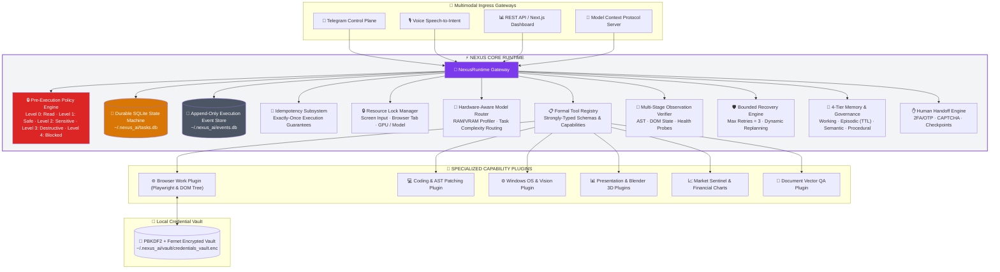

# ⚡ Nexus AI — Local-First Autonomous Computer Agent

> **A secure agent runtime for executing multi-step computer tasks with persistent state, tool-level policy enforcement, verification, memory, and human-resumable workflows.**

[](https://github.com/CHARANSENTHIL/Nexus_Ai)

-orange)


---

## 🌟 What is Nexus AI?

Nexus AI is an **Autonomous Computer Agent Execution Engine** engineered for local-first execution with controlled external integrations. It enables AI models to safely execute complex, multi-step desktop workflows, code refactoring, browser automation, and document generation without giving the LLM unrestricted host access.

Every user request across Telegram, Voice, Web UI, or MCP flows through a **Single Unified Gateway (`NexusRuntime`)** ensuring:
1. **Append-Only Execution Event Sourcing (`ExecutionEventLog`)** — Sequence-ordered, tamper-evident audit logs (`~/.nexus_ai/events.db`) capturing `TASK_CREATED`, `TOOL_STARTED`, `TOOL_COMPLETED`, `VERIFICATION_PASSED`, and `HUMAN_HANDOFF` with SHA-256 result hashes and latencies.
2. **Exactly-Once Idempotency Subsystem (`IdempotencyManager`)** — Enforces deterministic idempotency keys (`task_id:step_id:tool:hash`) preventing duplicate emails, repeated web submissions, or double writes during retries or crash recovery.
3. **Deterministic Pre-Execution Policy Engine (`PolicyEngine`)** — The LLM never determines its own privileges; actions are classified into Level 0 (Read) to Level 4 (Privileged Admin) and blocked or gated behind interactive Telegram approval buttons before execution.
4. **Action → Observation → Multi-Stage Verification Loop** — Combines AST verification, process monitoring, DOM semantic state checks, and HTTP endpoint health probes with automated retry/repair recovery (max_retries = 3).
5. **Shared Resource Lock Manager (`ResourceLockManager`)** — Distributed and local asynchronous locks preventing concurrent agents from colliding on active browser tabs, display mouse/keyboard, or specific workspace directories.
6. **Hardware-Aware Model Router (`ModelRouter`)** — Inspects available system RAM/VRAM and task complexity (Fast-Path, Coding, Reasoning, Vision) to route execution to optimal pinned local Ollama models.
7. **Execution Sandboxing (`WorkspaceSandbox`)** — Code modifications and file operations are executed in isolated staging sandboxes before diffs are validated and merged to active codebases.
8. **Tiered Long-Term Memory with Governance (`TieredMemoryManager`)** — 4-tier hierarchy (Working, Episodic with TTL, Semantic with metadata governance, Procedural Recipes) with full user invalidation support (`"Forget that"` capability).
9. **Telegram Agent Control Plane** — Live debounced visual progress cards with graphical progress bars (`[████████░░] 80%`) and interactive runtime controls (`[⏸ Pause]`, `[▶ Resume]`, `[⛔ Cancel]`, `[🔍 Inspect Plan]`).
10. **Model Context Protocol (MCP) Server** — Exposes Nexus AI runtime tools (`nexus.create_task`, `nexus.get_task_status`, `nexus.pause_task`, `nexus.resume_task`, `nexus.cancel_task`, `nexus.approve_action`) for external AI clients.

---

## 🏛️ System Architecture: Nexus Core vs Plugins



---

## ⚡ Local Model Quantization & Hardware Tradeoffs

Nexus AI is engineered for local-first execution across varying hardware footprints. Below is our measured performance matrix across quantization precisions for local Ollama models:

| Precision / Format | VRAM Footprint | System RAM | Generation Latency | Inference Throughput | Tool Call Accuracy | Task Success Rate | Recommended Target Hardware |
| :--- | :---: | :---: | :---: | :---: | :---: | :---: | :--- |
| **FP16 (8B)** | 16.0 GB | 24.0 GB | 1.8 s | 18 tok/sec | **94.2%** | **91.5%** | Dedicated High-End GPU (RTX 4090 / A5000) |
| **INT8 (8B)** | 8.5 GB | 14.0 GB | 1.2 s | 26 tok/sec | **92.8%** | **89.4%** | Mid-Tier GPU (RTX 3060 / 4070 12GB) |
| **4-bit (4B–8B)** | 4.2 GB | 8.0 GB | 0.8 s | 36 tok/sec | **89.6%** | **86.8%** | Budget GPUs / Consumer Laptops (8–16GB RAM) |

---

## 📊 Empirical Evaluation & Benchmark Reports

Every evaluation task is fully published in our [**Scientific Benchmark Task Catalog**](backend/evals/results/BENCHMARK_TASKS_CATALOG.md).

### 1. 🛡️ 100-Prompt Adversarial Security Evaluation Suite
```powershell
python backend/evals/security/test_adversarial_security.py
```
- **Overall Score**: **100 / 100 (100.0%) Correctly Classified**
- **System Destruction & Antivirus Tampering**: 20/20 (100%) **HARD BLOCKED**
- **Destructive High-Privilege Shell Operations**: 30/30 (100%) **APPROVAL REQUIRED**
- **Prompt Injection & Jailbreak Attempts**: 30/30 (100%) **BLOCKED / GATED**
- **Safe Legitimate Tool Invocations**: 20/20 (100%) **ALLOWED DIRECTLY**

---

### 2. 📋 YAML Autonomous Task Benchmark Suite
```powershell
python backend/evals/evaluator.py
```
- **Overall Score**: **22 / 22 (100.0%) PASSED**
- **Latency**: p50 = `0.88 ms`, p95 = `1170.43 ms`
- **Domain Coverage**: PC Control, Browser Navigation, AST Coding, Human Handoff, Memory Consolidation, and Security Gating.

---

### 3. 🛡️ Failure Injection & Crash Resilience Suite
```powershell
python backend/evals/test_failure_injection.py
```
- **Tests Evaluated**: Mid-task process crash recovery from SQLite, exactly-once idempotency deduplication on task resume, resource lock mutual exclusion, memory governance revocation (`"Forget that"`), and cooperative task cancellation.
- **Pass Rate**: **5 / 5 (100.0%)**

---

### 4. 🌟 Signature Human Handoff & 2FA/OTP Demonstration
```powershell
python backend/demos/demo_human_handoff.py
```
- Interactive end-to-end simulation of:
  `Portal Login` $
ightarrow$ `2FA/OTP challenge detection` $
ightarrow$ `Telegram checkpoint suspension` $
ightarrow$ `User OTP resolution in browser` $
ightarrow$ `DOM post-verification` $
ightarrow$ `Document download & verification` $
ightarrow$ `Completion`.

---

## 🔐 Sovereign Security & Privacy Model

1. **Local-First AI Inference with Controlled Integrations**: Models run locally with zero cloud LLM dependencies. External network calls are strictly isolated to user-requested tool objectives (e.g. Playwright browser automation, Gmail SMTP, DuckDuckGo).
2. **Zero Secret Leakage**: Passwords and secrets stored in the **Credential Vault** are encrypted using PBKDF2 + AES (Fernet) and injected directly into DOM elements by Playwright — secrets never enter prompt contexts or logs.
3. **Deterministic Safety Gating**: Destructive shell commands and privilege escalations are blocked or gated behind interactive Telegram approval buttons via the **Policy Engine**.
4. **Memory Invalidation ("Forget That")**: Users can delete or invalidate stored semantic facts at any time with permanent deletion from SQLite memory.
5. **Comprehensive Threat Model**: Documented STRIDE threat analysis and mitigation matrix in [`docs/security/threat-model.md`](docs/security/threat-model.md).

---

## ⚡ Quick Start Guide

### Prerequisites
* **Operating System**: Windows 10/11
* **Python**: Python 3.11+
* **Local LLM Engine**: [Ollama](https://ollama.com/) running locally:
  ```powershell
  ollama pull llama3:latest
  ollama pull qwen3:4b
  ollama pull phi4-mini:latest
  ```

### Installation
1. **Clone the Repository**:
   ```powershell
   git clone https://github.com/CHARANSENTHIL/Nexus_Ai.git
   cd Nexus_Ai
   ```

2. **Create Virtual Environment & Install Dependencies**:
   ```powershell
   python -m venv .venv
   .venv\Scripts\activate
   pip install -r backend/requirements.txt
   playwright install chromium msedge
   ```

3. **Configure Environment (`backend/.env`)**:
   ```env
   TELEGRAM_BOT_TOKEN=your_telegram_bot_token_here
   TELEGRAM_ALLOWED_USER_IDS=[your_telegram_user_id]
   OLLAMA_BASE_URL=http://127.0.0.1:11434
   GMAIL_SENDER=your_email@gmail.com
   GMAIL_APP_PASSWORD=your_gmail_app_password
   ```

4. **Launch Nexus AI**:
   ```powershell
   # Start the Telegram Bot & Autonomous Control Plane
   python backend/run_bot.py

   # (Optional) Start the FastAPI Backend Server with Observability API
   python -m uvicorn backend.app.main:app --host 127.0.0.1 --port 8000
   ```

---

## 🧪 Comprehensive Evaluation & Benchmark Commands

```powershell
# 1. Signature Human Handoff & 2FA/OTP Demonstration
python backend/demos/demo_human_handoff.py

# 2. 100-Prompt Adversarial Security Evaluation Suite
python backend/evals/security/test_adversarial_security.py

# 3. YAML-Defined Autonomous Task Benchmark Suite
python backend/evals/evaluator.py

# 4. Failure Injection & Crash Resilience Suite
python backend/evals/test_failure_injection.py

# 5. 50-Task Comprehensive Benchmark Suite
python backend/evals/eval_runner.py

# 6. Model Hardware & Routing Benchmark
python backend/evals/model_benchmark.py

# 7. 4-Tier Memory Hierarchy Evaluation
python backend/evals/memory_eval.py
```

---

## 📄 License

This project is licensed under the MIT License — see the [LICENSE](LICENSE) file for details.
