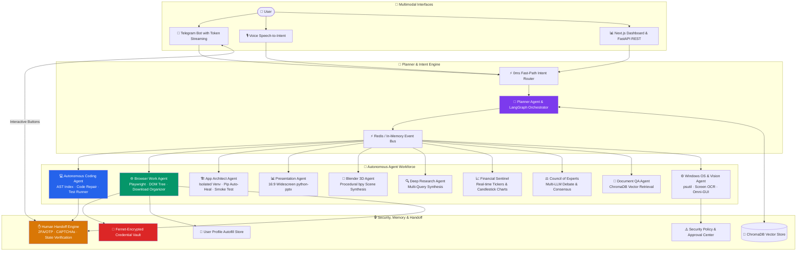

# ⚡ Nexus AI — Autonomous Operating System & Digital Work Automation Platform

> **A 100% Local-First, Sovereign Autonomous AI Platform that controls your PC, automates complex knowledge work, writes & debugs software, navigates the web, and collaborates with you in real-time.**

[](https://github.com/CHARANSENTHIL/Nexus_Ai)

-orange)


---

## 🌟 What is Nexus AI?

Nexus AI is not just a chatbot or a simple PC automation script. It is an **Autonomous Digital Coworker & OS Automation Engine** capable of completing multi-step objectives from start to finish.

Whether you need to:
* 💻 **Develop and debug software** — The **Autonomous Coding Agent** uses AST indexing to inspect repos, diagnose errors, apply targeted diff patches, and run tests.
* 🌐 **Complete end-to-end web workflows** — The **Browser Work Agent** navigates complex portals, bypasses 2FA/CAPTCHA via **Human Handoff**, injects encrypted credentials safely, autofills forms, and downloads/organizes reports.
* 📊 **Generate executive deliverables** — Creates modern **16:9 PowerPoint (.pptx) presentations**, renders **3D scenes in Blender**, analyzes financial markets with candlestick charts, or transcribes audio meetings.
* 🖥️ **Control and self-heal your operating system** — Manages processes, diagnoses failing commands with the **Self-Healing Pipeline**, and handles dangerous tasks via gated Telegram approvals.

---

## 🏛️ Comprehensive Architecture



---

## 🤖 The Autonomous Agent Workforce

| Agent | Core Capabilities & Deliverables | Primary Tools |
| :--- | :--- | :--- |
| **🌐 Browser Work Agent** | Closed-loop web navigation, semantic DOM/accessibility tree analysis, form autofill, safe credential injection, and download file organization. | Playwright, ARIA DOM snapshot, DuckDuckGo |
| **💻 Autonomous Coding Agent** | Multi-step software engineer: AST repository indexing, targeted symbol retrieval, root cause diagnosis, syntax-validated diff patching, and pytest execution. | AST parser, pytest runner, uvicorn/node dev server |
| **✋ Human Handoff Engine** | State machine lifecycle for handling 2FA/OTP, CAPTCHA challenges, and sensitive approvals with post-handoff state verification. | Telegram inline callbacks, DOM state verifiers |
| **📊 Presentation Agent** | Designs and builds structured, professional 16:9 widescreen PowerPoint (`.pptx`) decks with custom themes and structured slide layouts. | `python-pptx`, dynamic layout engine |
| **🏗️ App Architect Agent** | End-to-end full stack app generator with automated venv creation, AST dependency resolver, and pre-flight headless smoke testing. | Subprocess venv, pip resolver, smoke test verifier |
| **🎨 Blender 3D Agent** | Procedural 3D scene generation, lighting, materials, physics, and rendering via headless Blender Python (`bpy`). | Blender CLI, `bpy` scripts |
| **📈 Financial & Market Sentinel**| Real-time stock, crypto, and commodity analysis with technical indicators and generated candlestick charts. | `yfinance`, `mplfinance` |
| **⚖️ Council of Experts** | Multi-persona debate engine (Architect, Critic, Implementer) for complex architectural and strategic decisions. | Multi-role Ollama prompts |
| **📄 Document & PDF Q&A** | Ingests PDFs, documents, and codebases into ChromaDB vector memory for semantic multi-turn Q&A. | ChromaDB, PyPDF2, local embeddings |
| **📧 Email & n8n Workflows** | Drafts context-aware emails with attachments and dispatches via Gmail SMTP or n8n webhooks. | Gmail SMTP, n8n webhook API |
| **🎙️ Voice & Audio Assistant** | Continuous voice listening, speech-to-intent parsing, meeting audio transcription, and action item extraction. | SpeechRecognition, pyttsx3, audio pipeline |
| **👁️ Vision & Omni-GUI Copilot** | Screen OCR, error boundary scanning, viewport analysis, and PyAutoGUI mouse/keyboard coordinate automation. | Tesseract OCR, PyAutoGUI, Gemma vision |

---

## 🔐 Privacy & Security Model

Nexus AI is engineered from the ground up for **100% sovereign, local execution**:
1. **Zero Secret Leakage to LLMs**: Credentials and passwords stored in the **Credential Vault** are encrypted using PBKDF2 + AES (Fernet) and injected directly into DOM elements by Playwright — secrets never enter prompt contexts or logs.
2. **Deterministic Safety Boundaries**: Critical operating system modifications and destructive shell commands are gated behind Telegram **Approve / Reject** inline buttons via the **Security Policy Engine**.
3. **Local Models Only**: Optimized to run with zero cloud API keys using local Ollama models (`llama3:latest`, `qwen3:4b`, `phi4-mini:latest`, `gemma3:4b`).

---

## ⚡ Quick Start Guide

### Prerequisites
* **Operating System**: Windows 10/11
* **Python**: Python 3.11+
* **Local LLM Engine**: [Ollama](https://ollama.com/) running locally:
  ```powershell
  ollama pull llama3:latest
  ollama pull qwen3:4b
  ollama pull phi4-mini:latest
  ```

### Installation
1. **Clone the Repository**:
   ```powershell
   git clone https://github.com/CHARANSENTHIL/Nexus_Ai.git
   cd Nexus_Ai
   ```

2. **Create Virtual Environment & Install Dependencies**:
   ```powershell
   python -m venv .venv
   .venv\Scripts\activate
   pip install -r backend/requirements.txt
   playwright install chromium msedge
   ```

3. **Configure Environment (`backend/.env`)**:
   ```env
   TELEGRAM_BOT_TOKEN=your_telegram_bot_token_here
   TELEGRAM_ALLOWED_USER_IDS=[your_telegram_user_id]
   OLLAMA_BASE_URL=http://127.0.0.1:11434
   GMAIL_SENDER=your_email@gmail.com
   GMAIL_APP_PASSWORD=your_gmail_app_password
   ```

4. **Launch Nexus AI**:
   ```powershell
   # Start the Telegram Bot & Autonomous Workforce
   python backend/run_bot.py

   # (Optional) Start the FastAPI Backend Server
   python -m uvicorn backend.app.main:app --host 127.0.0.1 --port 8000
   ```

---

## 💡 Example Prompts & Capabilities

Send any of these natural language goals directly to your Telegram Bot:

### 🌐 Autonomous Web & Research
* *"Go to student portal https://portal.myuniversity.edu and download my latest grade report"*
* *"Search DuckDuckGo for top open-source AI frameworks in 2026 and summarize findings"*
* *"Login to https://github.com/login and verify my repository stars"*

### 💻 Software Engineering & Self-Healing
* *"Search codebase symbols for HandoffEngine and show me its outline"*
* *"Run pytest across the test suite and fix any failing test cases"*
* *"Create a new FastAPI service in generated_apps with CRUD endpoints and pre-flight verify it"*

### 📊 Presentations & Media
* *"Create an 8-slide presentation deck on Autonomous AI Agents in 2026 and mail it to my email"*
* *"Render a 3D procedural metallic torus in Blender with smooth lighting"*
* *"Analyze current Bitcoin market trends and send the candlestick chart"*

---

## 🧪 Verification & Testing

Nexus AI includes an automated test suite verifying all autonomous modules:

```powershell
# Run the autonomous module verification suite
python -m unittest backend/test_all_modules_suite.py

# Run live interactive input verification
python backend/verify_live_demo.py
```

---

## 📄 License

This project is licensed under the MIT License — see the [LICENSE](LICENSE) file for details.
