# ⚡ Nexus AI — Sovereign Autonomous Agent Execution Runtime

> **A 100% Local-First, Sovereign Autonomous Agent Execution Runtime that controls your PC, automates complex knowledge workflows, writes & debugs software, navigates the web with Human Handoff, and operates with durable state machines, event sourcing, and tiered memory.**

[](https://github.com/CHARANSENTHIL/Nexus_Ai)

-orange)


---

## 🌟 What is Nexus AI?

Nexus AI is an **Enterprise-Grade Autonomous Agent Runtime & Execution Engine** featuring deterministic state machines, append-only event sourcing, capability policy gating, isolated workspace sandboxing, tiered long-term memory, and multimodal human-in-the-loop controls.

Every action across Telegram, Voice, Web UI, or MCP flows through a **Single Unified Gateway (`NexusRuntime`)** ensuring:
1. **Append-Only Execution Event Sourcing (`ExecutionEventLog`)** — Sequence-ordered, tamper-evident audit logs (`~/.nexus_ai/events.db`) capturing `TASK_CREATED`, `TOOL_STARTED`, `TOOL_COMPLETED`, `VERIFICATION_PASSED`, `HUMAN_HANDOFF`, and `TASK_COMPLETED` with SHA-256 result hashes and execution durations.
2. **Exactly-Once Idempotency Subsystem (`IdempotencyManager`)** — Enforces deterministic idempotency keys (`task_id:step_id:tool:hash`) preventing duplicate emails, duplicate web submissions, or repeated database mutations on retry.
3. **Deterministic Pre-Execution Policy Engine (`PolicyEngine`)** — The LLM never decides its own privileges; actions are classified into Level 0 (Read) to Level 4 (Privileged Admin) and blocked or gated behind interactive Telegram approval buttons before execution.
4. **Action → Observation → Multi-Stage Verification Loop** — Combines AST verification, process monitoring, DOM semantic state checks, and HTTP endpoint health probes with automated retry/repair recovery (max_retries = 3).
5. **Shared Resource Lock Manager (`ResourceLockManager`)** — Asynchronous mutual exclusion locks preventing concurrent agents from colliding on active browser tabs, display mouse/keyboard, or specific workspace directories.
6. **Hardware-Aware Model Router (`ModelRouter`)** — Inspects available system RAM/VRAM and task complexity (Fast-Path, Coding, Reasoning, Vision) to route execution to optimal pinned local Ollama models.
7. **Execution Sandboxing (`WorkspaceSandbox`)** — Code modifications and file operations are executed in isolated staging sandboxes before diffs are validated and merged to active codebases.
8. **Tiered Long-Term Memory (`TieredMemoryManager`)** — 4-tier hierarchy combining Transient Working Memory, TTL-based Episodic Memory, ChromaDB Semantic Memory, and Procedural Workflow Recipes.
9. **Telegram Agent Control Plane** — Live debounced visual progress cards with graphical progress bars (`[████████░░] 80%`) and interactive runtime controls (`[⏸ Pause]`, `[▶ Resume]`, `[⛔ Cancel]`, `[🔍 Inspect Plan]`).
10. **Model Context Protocol (MCP) Server** — Exposes Nexus AI runtime tools (`nexus.create_task`, `nexus.get_task_status`, `nexus.pause_task`, `nexus.resume_task`, `nexus.cancel_task`, `nexus.approve_action`) for external AI ecosystems.

---

## 🏛️ System Architecture

```mermaid
graph TD
    subgraph Inputs ["📱 Multimodal Ingress Gateways"]
        TG["📱 Telegram Bot & Control Plane"]
        Voice["🎙️ Voice Speech-to-Intent"]
        WebUI["📊 Next.js Dashboard & FastAPI REST"]
        MCP["🔌 Model Context Protocol Server"]
    end

    subgraph RuntimeCore ["⚡ Unified Agent Runtime Engine"]
        TG & Voice & WebUI & MCP --> Runtime["🎯 NexusRuntime Gateway"]
        Runtime --> Policy["🔒 Pre-Execution Policy Engine
Level 0: Read · Level 1: Safe · Level 2: Sensitive · Level 3: Destructive · Level 4: Blocked"]
        Runtime --> StateMachine[("💾 Durable SQLite Task State Machine
~/.nexus_ai/tasks.db")]
        Runtime --> EventLog[("📜 Append-Only Execution Event Store
~/.nexus_ai/events.db")]
        Runtime --> Idempotency["🔑 Idempotency Manager
Exactly-Once Execution Guarantees"]
        Runtime --> ResourceLocks["🔒 Resource Lock Manager
Screen Input · Browser Tab · GPU / Model"]
        Runtime --> Router["🧠 Hardware-Aware Model Router
RAM/VRAM Profiler · Task Complexity"]
        Runtime --> Registry["📋 Formal Tool Registry
Strongly-Typed Schemas & Capabilities"]
        Runtime --> ActionLoop["🔄 Action → Observation → Verification Loop"]
        ActionLoop --> Recovery["🛡️ Bounded Recovery Engine
Max Retries = 3 · Dynamic Replanning"]
    end

    subgraph SandboxingAndMemory ["📦 Sandboxing & Tiered Memory"]
        ActionLoop --> Sandbox["📦 Workspace Sandbox
Isolated Temporary Staging & AST Diff Validation"]
        ActionLoop --> Memory["🧠 4-Tier Memory Hierarchy
Working · Episodic (TTL) · Semantic · Procedural"]
    end

    subgraph AutonomousAgents ["🤖 Specialized Agent Workforce"]
        Registry --> CodingAgent["💻 Autonomous Coding Agent
AST Index · Code Repair · Pytest"]
        Registry --> BrowserAgent["🌐 Browser Work Agent
Playwright · DOM Snapshots · Download Organizer"]
        Registry --> Handoff["✋ Human Handoff Engine
2FA/OTP · CAPTCHA · Checkpoints"]
        Registry --> PresAgent["📊 Presentation Agent
16:9 Widescreen python-pptx"]
        Registry --> BlenderAgent["🎨 Blender 3D Agent
Procedural bpy Scene Synthesis"]
        Registry --> SystemAgent["⚙️ Windows OS & Vision Agent
psutil · Screen OCR · Omni-GUI"]
    end

    subgraph SecurityVault ["🔐 Local Credential Vault"]
        BrowserAgent <--> Vault[("🔐 PBKDF2 + Fernet Encrypted Vault
~/.nexus_ai/vault/credentials_vault.enc")]
    end

    style Runtime fill:#7c3aed,color:#fff
    style Policy fill:#dc2626,color:#fff
    style Sandbox fill:#059669,color:#fff
    style CodingAgent fill:#2563eb,color:#fff
    style StateMachine fill:#d97706,color:#fff
    style EventLog fill:#4b5563,color:#fff
```



---

## 📊 Empirical Evaluation & Benchmark Reports

### 1. 🛡️ 100-Prompt Adversarial Security Evaluation Suite

Tested against 100 distinct adversarial vectors (defense disabling, registry destruction, shadow copy deletion, fork bombs, privilege escalation, and prompt injection jailbreaks):

```powershell
python backend/evals/security/test_adversarial_security.py
```

| Attack Category | Prompts Tested | Intercepted & Classified | Accuracy |
| :--- | :---: | :---: | :---: |
| **System Destruction & Antivirus Tampering** | 20 / 20 | **20 / 20** | **100.0%** (Hard Blocked) |
| **High-Privilege Destructive Operations** | 30 / 30 | **30 / 30** | **100.0%** (Gated Approval) |
| **Prompt Injection & Jailbreak Attempts** | 30 / 30 | **30 / 30** | **100.0%** (Blocked / Gated) |
| **Safe Legitimate Tool Invocations** | 20 / 20 | **20 / 20** | **100.0%** (Allowed Directly) |
| **OVERALL ADVERSARIAL ACCURACY** | **100 / 100** | **100 / 100** | **100.0% Accuracy** |

---

### 2. 📋 YAML Autonomous Task Benchmark Suite

Evaluated multi-stage operational tasks with multi-condition semantic verification:

```powershell
python backend/evals/evaluator.py
```

| Benchmark Domain | Tasks | Pass Rate | Status | Primary Verification Checks |
| :--- | :---: | :---: | :---: | :--- |
| **🖥️ PC Control & Diagnostics** | 5 / 5 | **100.0%** | `PASSED` | psutil CPU/RAM metrics, storage inspection, ping latency |
| **🌐 Autonomous Browser Workflows** | 5 / 5 | **100.0%** | `PASSED` | Playwright DOM navigation, vault secret injection, autofill |
| **💻 Codebase Intelligence & Sandboxing**| 4 / 4 | **100.0%** | `PASSED` | AST symbol lookup, outline generation, sandbox diff validation |
| **✋ Human Handoff Checkpoints** | 2 / 2 | **100.0%** | `PASSED` | OTP/CAPTCHA state suspension, checkpoint resumption |
| **🧠 Tiered Memory & Consolidation** | 3 / 3 | **100.0%** | `PASSED` | Working memory consolidation, TTL expiration pruning |
| **🔒 Security & Policy Gating** | 3 / 3 | **100.0%** | `PASSED` | Dangerous command block, approval gating, Fernet encryption |
| **🎯 OVERALL BENCHMARK METRIC** | **22 / 22** | **100.0%** | `EVALUATED` | **p50 Latency: 0.88 ms · p95 Latency: 1170.43 ms** |

---

## 🔐 Sovereign Security & Privacy

1. **Zero Secret Leakage to LLMs**: Credentials and passwords stored in the **Credential Vault** are encrypted using PBKDF2 + AES (Fernet) and injected directly into DOM elements by Playwright — secrets never enter prompt contexts or logs.
2. **Deterministic Pre-Execution Safety**: Critical operating system modifications and destructive shell commands are gated behind Telegram **Approve / Reject** inline buttons via the **Policy Engine**.
3. **Isolated Workspace Staging**: Code modifications are tested in isolated temporary directories (`WorkspaceSandbox`) before touching production files.
4. **Complete Threat Model**: Documented STRIDE threat analysis and mitigation strategies in [`docs/security/threat-model.md`](docs/security/threat-model.md).
5. **100% Local Inference**: Runs locally with zero required cloud API keys using local Ollama models (`llama3:latest`, `qwen3:4b`, `phi4-mini:latest`, `gemma3:4b`).

---

## ⚡ Quick Start Guide

### Prerequisites
* **Operating System**: Windows 10/11
* **Python**: Python 3.11+
* **Local LLM Engine**: [Ollama](https://ollama.com/) running locally:
  ```powershell
  ollama pull llama3:latest
  ollama pull qwen3:4b
  ollama pull phi4-mini:latest
  ```

### Installation
1. **Clone the Repository**:
   ```powershell
   git clone https://github.com/CHARANSENTHIL/Nexus_Ai.git
   cd Nexus_Ai
   ```

2. **Create Virtual Environment & Install Dependencies**:
   ```powershell
   python -m venv .venv
   .venv\Scripts\activate
   pip install -r backend/requirements.txt
   playwright install chromium msedge
   ```

3. **Configure Environment (`backend/.env`)**:
   ```env
   TELEGRAM_BOT_TOKEN=your_telegram_bot_token_here
   TELEGRAM_ALLOWED_USER_IDS=[your_telegram_user_id]
   OLLAMA_BASE_URL=http://127.0.0.1:11434
   GMAIL_SENDER=your_email@gmail.com
   GMAIL_APP_PASSWORD=your_gmail_app_password
   ```

4. **Launch Nexus AI**:
   ```powershell
   # Start the Telegram Bot & Autonomous Control Plane
   python backend/run_bot.py

   # (Optional) Start the FastAPI Backend Server
   python -m uvicorn backend.app.main:app --host 127.0.0.1 --port 8000
   ```

---

## 🧪 Evaluation & Benchmark Suite

Run the full battery of automated tests and empirical benchmark evaluators:

```powershell
# 1. Run the 100-Prompt Adversarial Security Evaluation Suite
python backend/evals/security/test_adversarial_security.py

# 2. Run the YAML-defined Autonomous Task Benchmark Suite
python backend/evals/evaluator.py

# 3. Run the 50-task comprehensive evaluation suite
python backend/evals/eval_runner.py

# 4. Run end-to-end agent integration test suite
python backend/test_all_modules_suite.py
```

---

## 📄 License

This project is licensed under the MIT License — see the [LICENSE](LICENSE) file for details.
